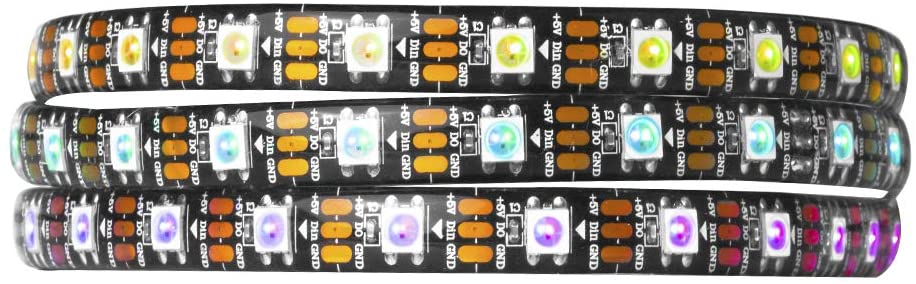

<p align="center">
  
</p>

# Lit Up

_Lit Up_ is a comprehensive system with mood detection, powered by machine learning, music recommendation, and audio visualization. The system recommends music based on the user's mood, and respond to the music's rhythm with LEDs. We hope the user's mood can lighten up with Lit Up!

## Motivation & Design

<p align="center">
  <em>"We breathe the light, we breathe the music, we breathe the moment as it passes through us." <strong>— Anne Rice</strong></em>
</p>

The main purpose behind implementing this project was how students, especially towards the end of the semester, would be going through a lot of stress. We believe a simple combination of light and music can trigger inner peace and joy. So our system would help a student or any person that is busy working on something and is anxious or stressed to lighten up based on how they’re feeling without having to waste time on choosing music by answering if they would like the music to change their mood or accompany it. Things are made more interesting by including a music visualizer LED strip to accompany the music. There is also the option of using just the music visualizer for party purposes without using the emotion detector to control it. This makes the usability of the device very flexible for the user to interact with in different scenarios.

The key design aspects we kept in mind was to make all the components of the device housed inside a single module which is a cardboard box in our case. So the Pi, the circuitry for the LED strip were housed inside the box. The camera was placed outside the box to give the user flexibility to change the location and orientation of the camera based on their posture to get the bet results for emotion detection. Also the entire control of the system was provided on the flask controller and designed to be minimalistic to ensure ease of access for the user. The controller provides the user with feedback for the positioning of their face wrt to the camera and options for music selection.


### Structure


### Storyboard


## Features & Demo

There are three key components in Lit Up.

- Mood detection

  The system can detect the moods of users, such as happy and sad. And based on the detection results, the system can recommend corresponding music to users to cheer them up.


- Audio visualization

  The LED strip can interact with the music. Based on the rhythm and strength of the music, the color and the flicker frequency of each LED spot will change accordingly. And spots on the LED strip can show different performances as a whole according to the music pieces.

- Controller

  We have a controller platform, where it can capture the user’s facial expression to detect his/her mood. And there are different kinds of music on the platform, based on the detection result, the system can recommend music to the user to cheer him/her up. The user can speak to interact with the platform, and the platform can respond with voices.

We tested our system with two users, and took a video of the testing process.

https://user-images.githubusercontent.com/52665472/145899429-551135e6-1b90-4c82-8fc6-b6213df82db2.mp4

Screenshots of the controller during the user testings are attached below.

<p float="left">
  
   
</p>

[//]: # (Videos need to be edited.)

## Hardware Setup
### Parts Needed

1. Raspberry Pi

   We used Raspberry Pi 4 Model B.

   [](https://vilros.com/products/raspberry-pi-4-model-b-8gb-ram?src=raspberrypi)

2. LED strip

   We used WS2812B LED strip. This project is also compatible with Adafruit NeoPixel.

   [](https://www.amazon.com/gp/product/B01CDTEE5W/ref=ppx_yo_dt_b_asin_title_o04_s00?ie=UTF8&th=1)

3. Microphone

   We used a USB microphone to capture audio input.
    
   [](https://www.amazon.com/SunFounder-Microphone-Raspberry-Recognition-Software/dp/B01KLRBHGM?ref_=ast_sto_dp&th=1&psc=1)

4. Web camera

   We used a web camera to capture user's facial expressions for the mood detection task.
 
   [](https://www.amazon.com/Provision-ISR-Webcam-Microphone-Compatible/dp/B08HL4VFFK)

6. 5V Power Supply

   A 5V AC/DC adaptor was used to supply power for the LED strip.

   [](https://www.amazon.com/gp/product/B078RXZM4C/ref=ppx_yo_dt_b_asin_image_o03_s01?ie=UTF8&th=1)
 
7. Level shifter
    
   The level shifter was used to shift voltage from 3.3V to 5V.
 
   [](https://www.amazon.com/gp/product/B08GJF43N3/ref=ppx_yo_dt_b_asin_image_o03_s00?ie=UTF8&psc=1)

### Raspberry Pi Wiring

1. Connect the webcam and the USB microphone to the Raspberry Pi.
2. Wire the LED strip with the Raspberry Pi.
   
   We followed the digram below for the wiring.
   
   
   
   Alternative ways to wire Raspberry Pi with the LED strip can be found in this [tutorial](https://learn.adafruit.com/neopixels-on-raspberry-pi/raspberry-pi-wiring).

## Dependency Installation

### Connect to your Pi and create a virtual environment

```
ssh pi@<your Pi's IP address>
...
pi@ixe00:~ $ virtualenv led_strip
pi@ixe00:~ $ source led_strip/bin/activate
(led_strip) pi@ixe00:~ $ 
```

### Clone the repository and install requirements 

```
(led_strip) pi@ixe00:~$ git clone https://github.com/yehaozz/Interactive-Lab-Hub.git
(led_strip) pi@ixe00:~$ cd Interactive-Lab-Hub/Final_project/
(led_strip) pi@ixe00:~/Interactive-Lab-Hub/Final_project $ ./install_tensorflow.sh
(led_strip) pi@ixe00:~/Interactive-Lab-Hub/Final_project $ pip install -r requirements.txt
```

It will take a while to install all the requirements. Although we have tested it several times, there might still be compatibility issues. However, most of them should be solved by searching the error message (google, stack overflow).

## Configuration & Tests

### Configuration

In [config.py](config.py):

- Set N_PIXELS to the number of LEDs in your LED strip.
- Set ORDER to match the color ordering of the LED strip. The color channel order is either “RGB” or “GRB”.

We also set other default configurations in the [config.py](config.py) script. The default settings should work fine if following the above mentioned steps. But these settings are also customizable. Feel free to modify them to suit your needs.

### Test the mood detection and the controller

To use the plain camera as input to the controller, uncomment the line 12 in [app.py](app.py) and comment out the line 13.  

```
12  # Camera = import_module('camera.camera_opencv').Camera
13  Camera = import_module('camera.camera_teachable_machine').Camera
14  camera = Camera()
```

Then run  

```
(led_strip) pi@ixe00:~/Interactive-Lab-Hub/Final_project $ python app.py
```

The video feeds should be displayed on the controller. By changing the Camera module chosen in [app.py](app.py), you can change the video processing pipeline and extract different information. 

### Test the LED strip

```
(led_strip) pi@ixe00:~/Interactive-Lab-Hub/Final_project $ sudo python led.py
```

If the LED strip is set up properly, you should be able to see three colors, red, green, and blue, sliding through the entire strip.

## Let the Interaction Begin

1. To run with mood detection, open a terminal window, and execute the following line. Follow the web address prompted in the terminal to interact with the system.

```
(led_strip) pi@ixe00:~/Interactive-Lab-Hub/Final_project $ python app.py
```   

2. In a separate terminal, run the following command to get the system ready for visualization.

```
(led_strip) pi@ixe00:~/Interactive-Lab-Hub/Final_project $ sudo python visualization.py
```

To run in the party mode (without mood detection), simply skip the first step.

## Side notes

We tried two mechanisms of mood detection, open-source repository, and Google teachable machine. The former one covered a wider range of emotions than the latter one, but did not work on Raspberry Pi in our experiments. Therefore, we went for Google teachable machine for the mood detection implementation.

## Credits

The following resources greatly helped with our implementation of Lit Up.

1. Emotion detection using deep learning: https://github.com/atulapra/Emotion-detection
2. LED strip test & setup: https://learn.adafruit.com/neopixels-on-raspberry-pi/raspberry-pi-wiring
3. NeoPixels Package on Raspberry Pi: https://learn.adafruit.com/neopixels-on-raspberry-pi/overview
4. Audio Reactive LED Strip: https://github.com/scottlawsonbc/audio-reactive-led-strip
5. Flask video streaming: https://github.com/miguelgrinberg/flask-video-streaming
6. Mediapipe: https://google.github.io/mediapipe/ 
7. FaceMesh: https://google.github.io/mediapipe/solutions/face_mesh
8. Teachable machine platform: https://teachablemachine.withgoogle.com/
9. Font generation: https://www.fontspace.com/category/marquee
10. Motion detection packages that we explored but cannot get them running properly on our raspberry pi. They are listed below for future reference. 
    * https://github.com/KaiX-UCSD/emotion-recognition 
    * https://github.com/rendzina/FacialExpression 
    * https://fablab.ruc.dk/facial-expression-recognition-on-a-raspberry-pi/ 
